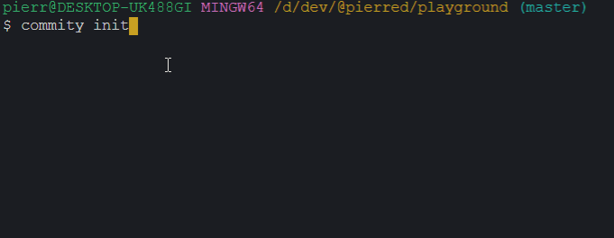

# [Commity](http://commity.online/#/)


[](https://travis-ci.org/PierreDemailly/commity)

**Commity** is a command line tool that will help you with commits conventions.
You can configure Commity fast & easily so every collaborators can follow the commit convention you need.



## Requirement

node >= 14.16.0

## Installation

You can use it globally for personnal use

    npm i -g @pierred/commity

But I would recommand to use it locally in team to make sure everyone use the same version

    npm i -D @pierred/commity

## Get started

+ `npm i -g @pierred/commity`
+ `commity init`
+ `commity`

## Usage

Commands:

| Command | Description |
| -- | -- |
| `commity` | Execute commity <br> *<sub>:bulb: project need to be commity friendly, see below</sub>* |
| `commity init` | Make your repo commity friendly creating a commity.json file |

Options:

| Option | Alias | Description |
| -- | -- | -- |
| `--addAll` | `-a` | Add all changes to the index (`git add --all`) before commit |
| `--push` | `-p` | Push after commit <br> *<sub>:bulb: if cannot push e.g. because your branch has no upstream branch, commity will be able to commit anyway</sub>* |

## Configuration
As You may see in `commity.json`, there are 2 parts you can configure: `fields` and `render`

```js
{
  "fields": [
    {
      "scope": {
        "label": "Select the type of change that you're committing",
        "type": "select",
        "selectOptions": [
          {
            "value": "feat",
            "description": "A new feature"
          },
          {
            "value": "fix",
            "description": "A bug fix"
          },
          {
            "value": "docs",
            "description": "Documentation only changes"
          },
          {
            "value": "refactor",
            "description": "Changes that neither fixes a bug or adds a feature"
          },
          {
            "value": "spec",
            "description": "Changes that affect unit tests"
          },
          {
            "value": "pkg",
            "description": "Changes that affect package (deps, config, readme...)"
          }
        ]
      }
    },
    {
      "message": {
        "label": "Choose the commit message",
        "decorations": {
          "prefix": ": "
        }
      }
    },
    {
      "ticket": {
        "label": "What is the issue id",
        "decorations": {
          "prefix": " #"
        },
        "required": false
      }
    }
  ],
  "render": "{{scope}}{{ticket}}{{message}}"
}
```

Your fields take a `field's key`, in the above example there are three `field's key` : *scope*, *message* and *ticket*.

You can choose 2 types of field:
- simple input where you just need a `label`
- select input where you have to add `"type": "select"` and provide `selectOptions`

`render` take the formatted string, replacing `` with the user input.

**More features incoming :tada:**
