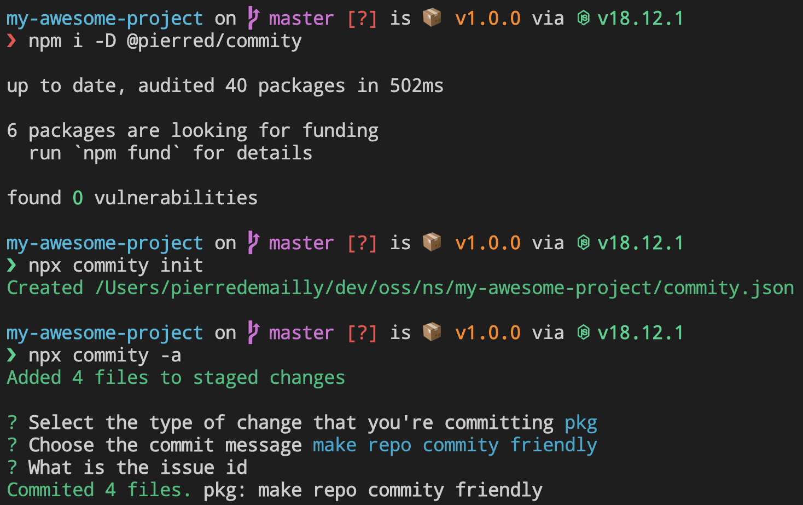

# Commity

[](https://npmjs.com/package/@pierred/commity)
[](https://github.com/PierreDemailly/commity/commits/main)

**Commity** is a command line tool that will help you with commits conventions.
You can configure Commity fast & easily so every collaborators can follow the commit convention you need.



## Requirement

node >= 14.16.0

## Installation

```shell
npm i -g @pierred/commity
```
or
```shell
npm i -D @pierred/commity
```

## Get started

> **warn** If your git diff tree is not clean, you may not want to use `-a` (`--addAll`) option.

```shell
npm i -g @pierred/commity
commity init
commity -a
```
or
```shell
npm i -D @pierred/commity
npx commity init
npx commity -a
```

## CLI

## `commity ìnit <options>` 
Create a new `commity.json` configuration file.
> **note** If a configuration file already exists, you can reset the configuration file via rich-interaction.

### `--overwrite` alias `-o` (works with `init`)

## `commity <options>`

Run Commity, allow to commit from chunks via rich-interaction. Workspace must be git initialized and commity friendly.

### `--addAll` alias `-a`
Add all changes to the index (`git add --all`) before commit.

### `--push` alias `-p`
Push to remote after commit.
> **note** If cannot push e.g. because your branch has no upstream branch, commity will be able to commit anyway.

### `--help` alias `-h`
Return usage informations.

### `--version`
Bump version.

## Configuration
You can setup `chunks` & `render` in `commity.json` file.

```json
{
  "chunks": [
    {
      "scope": {
        "label": "Select the type of change that you're committing",
        "type": "select",
        "selectOptions": [
          {
            "value": "feat",
            "description": "A new feature"
          },
          {
            "value": "fix",
            "description": "A bug fix"
          },
          {
            "value": "docs",
            "description": "Documentation only changes"
          },
          {
            "value": "refactor",
            "description": "Changes that neither fixes a bug or adds a feature"
          },
          {
            "value": "spec",
            "description": "Changes that affect unit tests"
          },
          {
            "value": "pkg",
            "description": "Changes that affect package (deps, config, readme...)"
          }
        ]
      }
    },
    {
      "message": {
        "label": "Choose the commit message",
        "decorations": {
          "prefix": ": "
        }
      }
    },
    {
      "ticket": {
        "label": "What is the issue id",
        "decorations": {
          "prefix": " #"
        },
        "required": false
      }
    }
  ],
  "render": "{{scope}}{{ticket}}{{message}}"
}
```

Each chunk is identified via the key and can be rendered as desired in `render` area.

### Chunk

#### `type` *string* *required*
Can be `simple` (**default value**) or `select`.

#### `label` *string* *required*
Chunk description.

#### `selectOptions` *{value: string, description: string}* *required* with `type = "select"`
Choices for the chunk.

#### `required` *boolean*
Weither the chunk is required.

### `decorations` *{prefix: string}*
Allow to decorate optional chunks so it don't mess the final render if the chunk is optional & skipped.
If the chunk is required, it's same as decorating in `render` directly.

### render
Formatted commit, replacing `{{chunk's key}}` with the user input.

**More features incoming :tada:**
